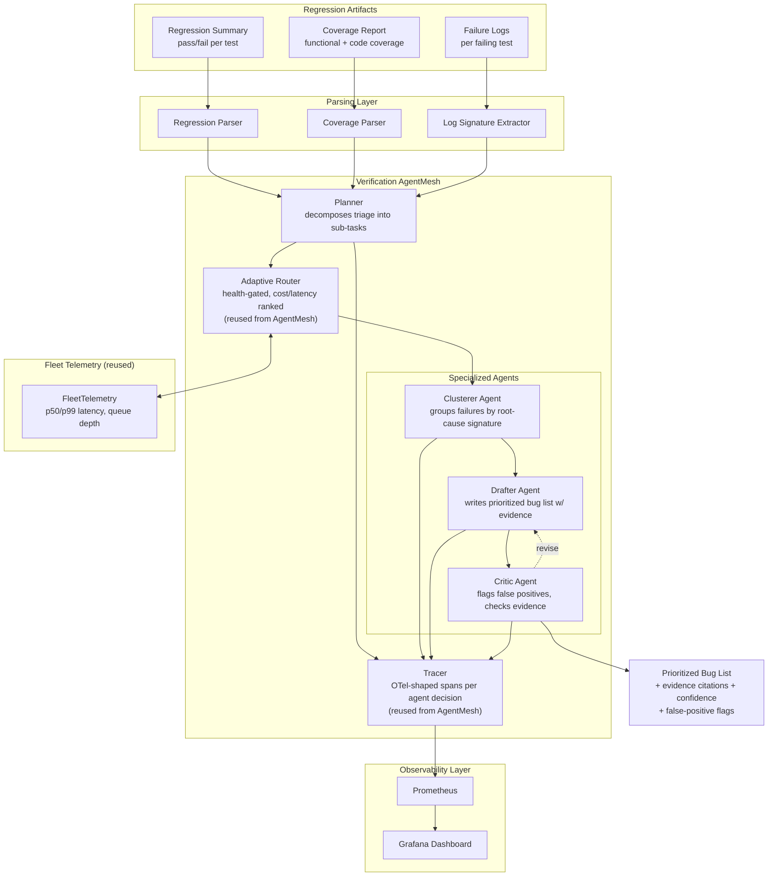

# Agentic Verification Triage System
## A Multi-Agent Orchestration Framework for UVM/SystemVerilog Coverage Triage and Bug Prioritization

**Project Proposal**
**Author:** Archana Chetan
**Date:** July 2026
**Status:** Proposed — Portfolio / Applied Research Project

---

## 1. Executive Summary

The Agentic Verification Triage System is a multi-agent pipeline that ingests UVM/SystemVerilog regression and coverage reports from a chip verification run, clusters failing tests by likely root-cause signature, drafts a prioritized bug list, and independently critiques that list to flag false positives — before a verification engineer manually triages what is often thousands of individual test failures per regression cycle.

This project directly extends the multi-agent orchestration architecture of an existing production system, **AgentMesh** (cost-aware, self-observing multi-agent orchestration for LLM fleets — planner → coder/critic roles, adaptive routing driven by live telemetry, full OpenTelemetry tracing of every agent decision), retargeted at a new domain: verification coverage triage. As with the RTL Debug Copilot proposal, the objective is not to invent a new orchestration paradigm, but to demonstrate that a working, telemetry-driven multi-agent system can be **retargeted at domain-specific engineering data quickly, with the same rigor around tracing, evaluation, and honest reporting** already proven in prior work.

**Why this matters for hiring managers:** verification remains the largest bottleneck in chip tape-out cycles, and coverage/bug triage is repetitive, high-volume, pattern-driven work that scales poorly with headcount. Public, working demonstrations of multi-agent systems applied specifically to EDA/verification workflows — with real tracing and real evaluation, not a slide deck — are rare. This project targets that gap directly, and lines up with the "AI Verification Engineer" and "Coverage Data Analyst" role families identified as the most in-demand semiconductor-AI niche.

---

## 2. Problem Statement

A single regression run on a moderately complex SoC design can produce thousands of individual test results, with coverage reports spanning functional coverage groups, code coverage (line/branch/toggle/FSM), and assertion coverage. When failures occur, a verification engineer must:

1. Scan the regression summary to separate genuine design bugs from testbench/environment issues (flaky tests, incorrect stimulus, tool licensing failures)
2. Group failures that share a root cause — the same underlying RTL bug often manifests as dozens of "different" test failures
3. Cross-reference functional coverage holes against the test plan to identify which failures represent real coverage gaps versus redundant signal
4. Prioritize the resulting bug list for the design team, since not all failures are equally urgent
5. Repeat this triage exercise every regression cycle, often re-deriving the same clustering and prioritization judgment calls

This is fundamentally a multi-step reasoning-and-classification problem over structured, high-volume data — a strong fit for a multi-agent pipeline where each agent owns a narrow, well-defined sub-task rather than one model attempting the entire triage in a single pass.

**Core hypothesis:** decomposing verification triage into specialized agents (coverage parser → failure clusterer → bug list drafter → critic) with full tracing of each decision produces a more accurate, more auditable, and more trustworthy triage output than a single end-to-end LLM call — mirroring the reasoning that motivated AgentMesh's planner/coder/critic decomposition for code generation.

---

## 3. Objectives

| Objective | Success Criterion |
|---|---|
| Parse UVM/SystemVerilog regression and coverage reports into structured data | ≥95% of test artifacts from open-source regression formats parsed without manual intervention |
| Cluster failing tests by root-cause signature | On a seeded-bug test set, cluster purity ≥70% (failures from the same seeded bug grouped together) |
| Draft a prioritized, evidence-cited bug list | Every bug list entry traceable to specific failing tests and coverage evidence — zero unsupported claims |
| Critic agent catches false positives | ≥50% reduction in false-positive bug entries compared to the drafting agent's output alone, measured against a labeled validation set |
| Full decision tracing | Every agent decision (clustering choice, priority ranking, critic override) captured as an OTel-shaped span, reusing AgentMesh's tracer |
| Honest validation report | All clustering/accuracy claims backed by reproducible scripts against seeded, labeled bug data — no cherry-picked examples |

---

## 4. Non-Goals (Explicitly Out of Scope)

- **Not** a replacement for engineering judgment on bug severity or fix ownership — output is a prioritized, evidence-backed draft for human review, not an autonomous bug tracker
- **Not** trained on any proprietary, NDA-covered, or employer-owned verification data — all evaluation data sourced from open-source hardware projects with synthetically seeded bugs and coverage holes
- **Not** claiming to replace commercial coverage-analysis tooling (Synopsys VC Coverage, Cadence vManager) — this is a research prototype demonstrating the multi-agent triage approach, not a competing commercial product
- **Not** attempting formal verification or model-checking in v1 — scope is dynamic simulation coverage and regression failures only

---

## 5. System Architecture

### 5.1 Parsing Layer
- **Regression Parser:** ingests standard regression summary formats (pass/fail status, seed, testname, runtime) into structured records
- **Coverage Parser:** parses functional coverage group/coverpoint/cross data and code coverage (line/branch/toggle/FSM) from standard coverage database export formats (e.g., UCIS-compatible text/XML exports), identifying coverage holes relative to the test plan
- **Log Signature Extractor:** reuses the log-parsing approach from the RTL Debug Copilot proposal — extracts UVM_ERROR/UVM_FATAL lines and assertion failure signatures per failing test, producing a compact feature representation for clustering

### 5.2 Verification AgentMesh (core contribution)
Directly reuses AgentMesh's orchestration primitives, retargeted with new agent roles:

- **Planner:** decomposes the incoming regression batch into sub-tasks (cluster this batch, draft bugs for these clusters, critique this draft), mirroring AgentMesh's existing planner → coder/critic structure
- **Clusterer Agent:** groups failing tests by root-cause signature using a hybrid approach — structured feature similarity (shared assertion IDs, shared module hierarchy paths, similar failure timestamps relative to reset) combined with LLM-based semantic grouping for cases structured features don't cleanly separate
- **Drafter Agent:** for each cluster, drafts a bug report: probable root cause, affected tests, supporting coverage/log evidence, and a priority score derived from coverage-hole severity and cluster size
- **Critic Agent:** independently reviews each drafted bug entry against the underlying evidence, flagging entries where the evidence doesn't actually support the claimed root cause (the same critic-role pattern AgentMesh already uses to grade codegen output against real execution, applied here to grade triage output against real coverage/log evidence)
- **Adaptive Router:** reused unmodified from AgentMesh — routes each agent's calls across the available model fleet based on live health, cost, and latency signals, rather than static assignment
- **Tracer:** reused unmodified — every planner decision, cluster assignment, draft, and critic override becomes an OTel-shaped span, so any output can be traced back to the exact reasoning chain that produced it

### 5.3 Observability Layer
Consistent with AgentMesh's existing stack: Prometheus + Grafana + OTel Collector, tracking agent-level latency, clustering confidence distributions, critic override rate, and end-to-end triage throughput (regressions processed per hour).

---

## 6. Technology Stack

| Layer | Technology |
|---|---|
| Orchestration | Python 3.12, reused AgentMesh planner/router/tracer core |
| Agent framework | FastAPI service, OTel-shaped spans |
| Clustering | scikit-learn (structured features) + LLM semantic grouping fallback |
| LLM serving | vLLM fleet (reused infra) |
| Coverage/log parsing | Custom parsers (Python), UCIS-compatible export formats |
| Observability | Prometheus, Grafana, OpenTelemetry |
| CI/CD | GitHub Actions, pytest |
| Test data | Open-source RTL projects with synthetically seeded bugs and coverage holes |

---

## 7. Evaluation Methodology

Following the same honest-validation discipline used in AgentMesh (real HumanEval execution grading, not simulated scores) and the RTL Debug Copilot proposal:

**Test set construction:**
1. Select 2–3 open-source verification environments with existing UVM testbenches (e.g., OpenTitan peripherals, a RISC-V core testbench)
2. Synthetically seed 15–25 distinct bugs across the design, each expected to manifest as multiple correlated test failures (the way real bugs do)
3. Run full regressions, capturing real coverage reports and failure logs
4. Feed the resulting artifacts through the triage pipeline; record:
   - **Clustering accuracy:** do failures from the same seeded bug get grouped together? (cluster purity / adjusted Rand index against ground truth)
   - **Drafting accuracy:** does the drafted root-cause description match the actual seeded bug?
   - **Critic effectiveness:** how many incorrect drafter outputs does the critic correctly flag, and does it introduce new false negatives (rejecting correct drafts)?
5. Publish `VALIDATION_REPORT.md` with full seeded-bug ground truth, raw agent outputs, aggregate metrics, and an explicit section on failure modes — cases where clustering merged unrelated bugs, or the critic missed a false positive

**No claim will be published without a reproducible script backing it.**

---

## 8. Milestones & Timeline

| Phase | Deliverable | Est. Duration |
|---|---|---|
| 1. Domain onboarding | Review of UVM coverage model concepts, functional/code coverage formats, select open-source test environments | 1 week |
| 2. Parsing layer | Regression parser, coverage parser, log signature extractor, unit tested | 2 weeks |
| 3. AgentMesh retargeting | Fork planner/router/tracer core; implement Clusterer, Drafter, Critic agents | 2.5 weeks |
| 4. Bug seeding & test harness | Seed 15–25 bugs across 2–3 open-source designs; build ground-truth labels | 1.5 weeks |
| 5. Observability integration | Reuse Prometheus/Grafana/OTel stack, add triage-specific dashboards (cluster purity, critic override rate) | 3–4 days |
| 6. Evaluation & validation report | Run full evaluation, publish `VALIDATION_REPORT.md` | 1.5 weeks |
| 7. Documentation & demo | Architecture docs, README, demo walkthrough | 1 week |

**Total estimated timeline: ~9–10 weeks part-time**

---

## 9. Risks & Mitigations

| Risk | Mitigation |
|---|---|
| Domain unfamiliarity with coverage models and UCIS export formats | Scope to 2–3 well-documented open-source verification environments; lean on existing UVM/coverage methodology documentation rather than inventing heuristics from scratch |
| Clustering conflates unrelated failures (over-merging) | Combine structured feature similarity with LLM semantic grouping, and explicitly report cluster purity / Rand index rather than a vague "looks right" claim |
| Critic agent becomes a rubber stamp (approves everything) | Evaluate critic effectiveness independently — measure both false positives caught AND new false negatives introduced, so a lazy critic can't inflate its own score |
| Overclaiming on a small seeded-bug set | Explicitly report sample size (15–25 bugs) and treat results as early-stage validation, not production-grade accuracy claims |
| Reused AgentMesh components don't transfer cleanly to non-codegen tasks | Budget explicit time (Phase 3) for adapting the planner/router interfaces rather than assuming a drop-in fork; document any interface changes required |

---

## 10. Relevance to Target Role

This project is designed to demonstrate the specific competencies most valued in AI-Verification-Engineer and Coverage-Data-Analyst hiring, while reusing infrastructure that already proves broader AI-infra maturity:

- **Multi-agent system design with real tracing** — direct extension of a working, telemetry-driven orchestration system, not a from-scratch prototype
- **ML-driven verification/coverage analysis** — clustering and evidence-based bug prioritization map directly to "AI-driven verification flows" and "predictive test generation and automated bug localization"
- **Rigorous, honest evaluation practice** — seeded-bug methodology with cluster-purity metrics and explicit false-positive/negative reporting, consistent with prior published validation reports
- **Fast domain onboarding** — explicitly designed to show the "learn a new technical domain quickly" trait that applied-AI-for-silicon roles prioritize over deep prior EDA experience
- **Production engineering discipline** — CI/CD, full observability, and reused (not reinvented) infrastructure components, signaling engineering maturity over one-off scripts

---

## 11. Appendix: Open-Source Data Sources Under Consideration

- [OpenTitan](https://github.com/lowRISC/opentitan) — extensive UVM testbenches and coverage models across multiple IP blocks, ideal for realistic multi-bug seeding
- [PicoRV32](https://github.com/YosysHQ/picorv32) — compact core, useful for controlled, easily-labeled bug seeding
- [cocotb](https://github.com/cocotb/cocotb) — Python-based verification framework, useful if a lighter-weight testbench environment is preferred over full UVM for early prototyping
- Yosys / Icarus Verilog / Verilator — open-source simulation toolchain for generating real regression and coverage data without commercial EDA licensing

---

*This proposal follows the same documentation and validation standards as prior published work (AgentMesh, PagedKV-Fusion, vLLM-HybridAttn) — every accuracy or performance claim will be backed by a reproducible script, and any component not yet fully verified will be explicitly labeled as such rather than implied to be production-ready.*
