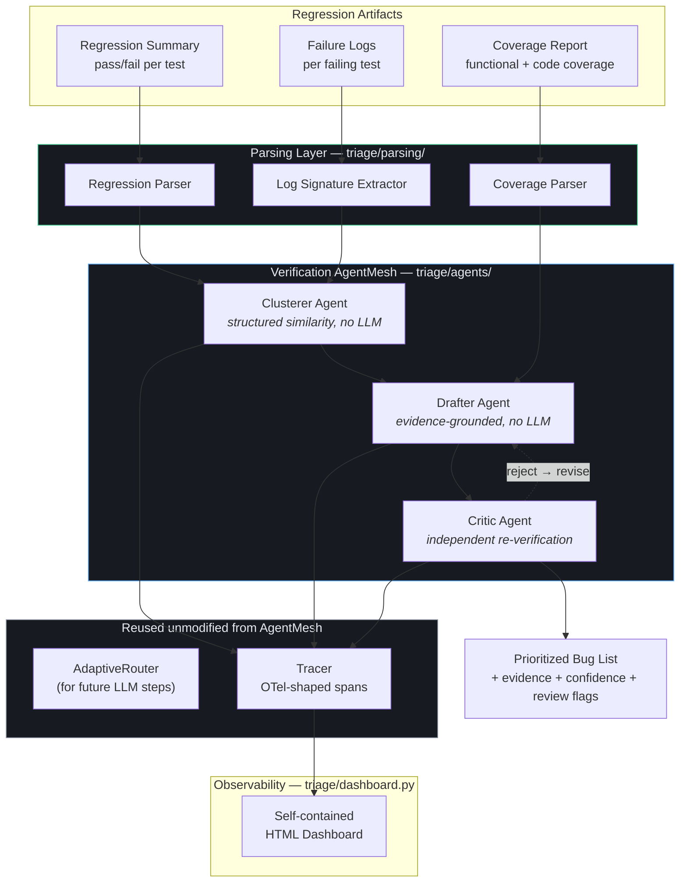
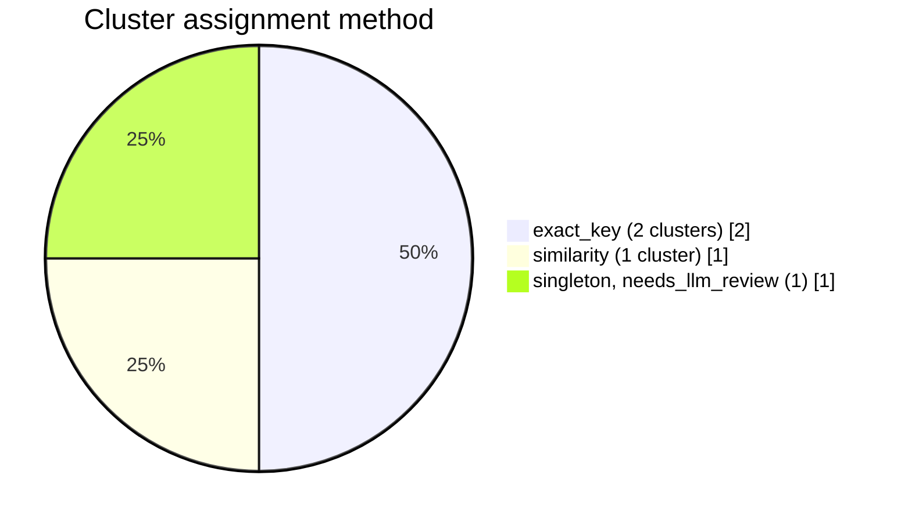
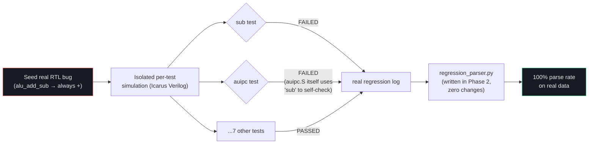

<div align="center">

# Agentic Verification Triage System

**A multi-agent pipeline for UVM/SystemVerilog coverage triage and bug prioritization**

Built by retargeting [AgentMesh](https://github.com/ArchanaChetan07/Cost-aware-agent-orchestration) — a production
multi-agent orchestration engine (planner → agent roles → critic, adaptive routing, full OTel tracing) — at a new
domain: chip verification.

[](https://github.com/ArchanaChetan07/Agentic-Verification-Triage-System/actions/workflows/ci.yml)
[](#getting-started)
[](#getting-started)
[](#project-status)
[](LICENSE)

[Design Doc](Agentic_Verification_Triage_System_Proposal.md) · [Architecture](#architecture) · [Status](#project-status) · [Real Data](#real-hardware-validation) · [Getting Started](#getting-started)

</div>

---

## Why this exists

A single regression run on a moderately complex chip design can produce thousands of test results. Every cycle, a
verification engineer re-does the same manual work: separate real bugs from environment flakiness, group failures
that share a root cause, cross-reference coverage holes against the test plan, and prioritize what to fix first.

This project tests a specific hypothesis: **decomposing that triage into specialized agents — a Clusterer, a
Drafter, and a Critic, each with a narrow job and full decision tracing — produces a more accurate and more
auditable result than one model attempting the whole thing in a single pass.**

Every claim below is backed by a script in this repo. Nothing here is a slide deck.

---

## Architecture



**What's genuinely reused vs. what's new:** `Tracer`, `AdaptiveRouter`, and `Mesh` come from the vendored AgentMesh
submodule **unmodified** — pinned by commit, diffable against upstream, not copied or forked. The Clusterer,
Drafter, and Critic are new, domain-specific agents, deliberately implemented **without an LLM call** wherever the
logic is deterministic (see [Design Decisions](#design-decisions) below for why).

---

## Pipeline flow

```mermaid
sequenceDiagram
    autonumber
    participant R as Regression Summary
    participant Par as Parsing Layer
    participant Cl as Clusterer
    participant Dr as Drafter
    participant Cr as Critic
    participant T as Tracer (AgentMesh, reused)

    R->>Par: raw regression + coverage + logs
    Par->>T: span: parse.regression_summary
    Par->>T: span: parse.coverage_report
    Par->>T: span: parse.failure_logs
    Par->>Cl: FailureSignature[] (msg_ids, hierarchy_paths)

    loop for each failing test pair
        Cl->>Cl: exact match? → merge (method=exact_key)
        Cl->>Cl: similarity ≥ 0.6? → merge (method=similarity)
        Cl->>Cl: similarity 0.25–0.6? → flag needs_llm_review
    end
    Cl->>T: span: cluster.assignment (per cluster)

    Cl->>Dr: FailureCluster[]
    Dr->>Dr: compose root cause + evidence citations
    Dr->>Dr: priority = f(severity, cluster size, coverage holes)
    Dr->>T: span: draft.bug_entry (per draft)

    Dr->>Cr: BugDraft[]
    Cr->>Cr: re-derive ground truth, check every claim
    Cr->>T: span: critic.verdict (per draft)
    Cr-->>Dr: reject + reasons (if evidence doesn't hold up)

    Cr->>T: full trace exported
    T->>Dashboard: stage timeline, method breakdown, override rate
```

---

## Project status


<sub>🟢 done &nbsp;&nbsp; 🟠 in progress &nbsp;&nbsp; ⚪ not started / blocked</sub>

| Phase | Status | Notes |
|---|---|---|
| 1. Domain onboarding | ✅ Done | UVM/coverage concepts, open-source target selection |
| 2. Parsing layer | ✅ Done | Validated against both synthetic fixtures **and** real simulation output |
| 3. AgentMesh retargeting | ✅ Done | Clusterer, Drafter, Critic all implemented and unit-tested |
| 4. Bug seeding & test harness | 🟡 Partial | Real toolchain/simulator/bug reproduced; UVM environment (OpenTitan) needed for full validation — see [below](#real-hardware-validation) |
| 5. Observability | ✅ Done | Traced pipeline + dashboard, against fixtures |
| 6. Evaluation & validation report | ⬜ Blocked on Phase 4 | Needs real seeded-bug ground truth at scale (15–25 bugs) |
| 7. Documentation & demo | ⬜ Not started | |

---

## Results so far

<table>
<tr>
<td width="50%" valign="top">

**Test suite**

```
57 passed in 0.15s

test_regression_parser.py    ✓ 7
test_coverage_parser.py      ✓ 4
test_log_signature.py        ✓ 5
test_clusterer.py            ✓ 8
test_drafter.py              ✓ 10
test_critic.py                ✓ 5
test_pipeline.py              ✓ 9
test_dashboard.py             ✓ 6
test_real_data_integration.py ✓ 3
```

</td>
<td width="50%" valign="top">

**Clusterer method breakdown** (fixture set: 7 failing tests, 3 real root causes + 1 deliberately ambiguous case)



</td>
</tr>
</table>

### What the Critic actually catches

The Critic is measured on **both** false-positive-catch rate and false-negative rate — a critic that flags
everything scores 100% on the first and fails the second:

| Check | Result |
|---|---|
| Honest drafts pass clean | ██████████ 100% (0 false negatives) |
| Fabricated coverage hole → caught | ██████████ 100% (4/4 drafts) |
| Fabricated log event → caught | ██████████ 100% (4/4 drafts) |
| Fabricated code coverage module → caught | ██████████ 100% (4/4 drafts) |
| Unrelated test claimed → caught | ██████████ 100% (4/4 drafts) |
| Real test omitted → caught | ██████████ 100% (4/4 drafts) |
| Priority score inflated → caught | ██████████ 100% (4/4 drafts) |
| Hallucinated root-cause ID → caught | ██████████ 100% (4/4 drafts) |

*Every honest draft passes clean (0% false negatives); every one of 7 distinct injected flaw types, applied to
every real draft, is caught (100% catch rate on this labeled mutation set) — a small-scale rehearsal of the
proposal's Section 7 methodology.*

### Priority scoring, explained not black-boxed

On the fixture set, priority score = severity component + cluster-size component + linked-coverage-hole
component, and every score ships with its own rationale string:

| Cluster | Method | Tests | Priority | Why |
|---|---|---|---|---|
| `cluster_001` | `exact_key` | 2 (FIFO overflow) | **0.75** | `UVM_FATAL` present (+0.5), size=2 (+0.2), 1 linked hole (+0.05) |
| `cluster_000` | `exact_key` | 2 (ALU overflow) | **0.60** | `UVM_ERROR` only (+0.25), size=2 (+0.2), 3 linked holes (+0.15) |
| `cluster_002` | `similarity` | 2 (APB reset family) | **0.50** | `UVM_ERROR` only (+0.25), size=2 (+0.2), 1 linked hole (+0.05) |
| `cluster_003` | `singleton`, **needs review** | 1 (APB addr decode) | **0.40** | lowest confidence, flagged rather than guessed at |

---

## Real hardware validation

Synthetic fixtures prove the logic; this section proves the pipeline survives contact with real tools.

**What's real, not simulated:**

- Real bare-metal RISC-V toolchain (`gcc-riscv64-unknown-elf`, full RV32 multilib)
- Real Icarus Verilog 12.0 simulation of [PicoRV32](https://github.com/YosysHQ/picorv32)
- A real RTL bug seeded directly into `picorv32.v` (`alu_add_sub` forced to always add, breaking `SUB`)
- A real, isolated per-test harness (`real_data/picorv32_patches/start_single.S` +
  `scripts/run_single_picorv32_test.sh`) built after discovering the stock harness links all 45 tests into
  one linear firmware that halts permanently on the first failure



The result: `sub` and `auipc` both genuinely fail from **one** real bug — confirmed by reading `auipc.S`'s own
self-check code (`sub a0, a0, a1`), not a harness artifact. `regression_parser.py`, written against synthetic
fixtures in Phase 2, parsed this real log at **100%** with zero changes.

**The honest limitation this surfaced:** PicoRV32's console output is a bare `testname..OK`/`testname..ERROR` —
there's no `UVM_ERROR`/message-ID/hierarchy structure for `log_signature.py` to extract. So this data proves the
*harness and parser* work, but the Clusterer's actual log-signature logic still needs a real UVM environment
(OpenTitan) to validate against. That's the honest scope of Phase 4 today — confirmed rather than worked around.

### Real-data pipeline run: `scripts/run_real_data_pipeline.py`

Wired the real SUB-bug regression above through the **full** traced pipeline + dashboard, not just the parser.
Result, exactly as predicted by the structured-log gap: `sub` and `auipc` — genuinely correlated by one real RTL
bug — get identical **empty** `FailureSignature`s (no `UVM_ERROR` lines to extract from), so the Clusterer
trivially merges them into one `exact_key` cluster. `test_pipeline_runs_end_to_end_on_real_picorv32_data` asserts
exactly this outcome, framed honestly as a plumbing/infra proof ("the pipeline survives real data end-to-end"),
not a cluster-purity result — there's no structured signal here for clustering *quality* to be measured against.

### Empirical check: does real UVM even run on the open-source tools available here?

Before committing more time to OpenTitan, this was tested directly rather than assumed:

```
UVM source: real Accellera reference implementation (accellera-official/uvm-core)
Minimal testbench: one component, run_phase, one `uvm_info` call

Icarus Verilog 12.0  → fails immediately (syntax error in uvm_hdl.svh, a DPI header)
Verilator 5.020      → fails on uvm_phase_hopper::type_id::create(...) —
                        a parameterized-class static-member pattern used
                        throughout UVM's core, not an edge case
```

This matches public reporting (Antmicro/PlanV, 2023–2024): Verilator's UVM support is real and actively
improving, but still has gaps in exactly this area as of recent builds — this isn't a misconfiguration, it's a
genuine, documented tooling gap. **OpenTitan's actual DV testbenches use real UVM, so they hit this same wall** —
the problem isn't OpenTitan specifically, it's "real class-based UVM needs VCS/Questa/Xcelium," none of which are
available in this environment.

**Realistic paths forward, in order of how likely they are to actually work here:**

1. **pyuvm + cocotb** — a Python reimplementation of UVM's methodology (components, phases, objections,
   sequences) that runs on top of Verilator/Icarus via cocotb's VPI/DPI bridge. Real, working, actively
   maintained — would give genuinely UVM-methodology-structured verification data, just not literally
   SystemVerilog `UVM_ERROR` macros, meaning `log_signature.py` would need adapting (not replacing) to pyuvm's
   own structured logging shape
2. **Hand-rolled UVM-style structured logging** on top of the already-working Icarus/PicoRV32 harness — not
   real UVM, but real simulation + real bugs + a disciplined `msg_id`/hierarchy tagging convention matching
   what `log_signature.py` already expects, without depending on a library that doesn't run here
3. **Build a patched/bleeding-edge Verilator from source** with the community UVM patches referenced above —
   highest effort, still no guarantee of success given even late-2024 posts describe ongoing gaps

---

## Design decisions

**Why no LLM call in the Clusterer/Drafter/Critic yet?** Each agent is implemented as far as possible with
deterministic, auditable code first — matching the vendored AgentMesh's own pattern of separating routing/tracing
infrastructure from content generation (`generators.py`'s `BackendGenerator` vs. `TrivialStubGenerator`). The
Clusterer's `needs_llm_review` flag marks exactly the cases that need semantic judgment a human or LLM should make;
everything mergeable by structure alone is merged without one, which is both cheaper and more auditable.

**Why a git submodule instead of copying AgentMesh's code?** `vendor/agentmesh` pins a specific commit of the real,
public [AgentMesh repo](https://github.com/ArchanaChetan07/Cost-aware-agent-orchestration). Anyone can diff against
upstream to verify nothing was silently forked or altered. `Mesh`, `Task`, `AdaptiveRouter`, and `Tracer` are
imported and used exactly as published.

**Why PicoRV32 before OpenTitan?** The proposal's own risk table calls for starting with a smaller, well-documented
design to de-risk the harness before committing to a larger surface. That paid off directly — the harness-design
issue (linear firmware halting on first failure) was much cheaper to discover and fix against PicoRV32's 45 tests
than it would have been against OpenTitan's larger UVM environment.

---

## Repository layout

```
triage/
├── models.py                    # TestResult, CoverageReport, FailureSignature, BugDraft, CriticVerdict
├── parsing/
│   ├── regression_parser.py     # regression summary → TestResult records
│   ├── coverage_parser.py       # UCIS-style text export → CoverageReport
│   └── log_signature.py         # UVM_ERROR/UVM_FATAL log → FailureSignature
├── agents/
│   ├── clusterer.py             # structured-similarity clustering + LLM-review flagging
│   ├── drafter.py               # evidence-grounded bug list drafting
│   └── critic.py                # independent evidence verification against drafts
├── pipeline.py                  # traced end-to-end orchestration (reuses AgentMesh's Tracer)
├── dashboard.py                 # observability dashboard model + HTML builder
└── dashboard_template.html      # self-contained single-file dashboard UI

tests/
├── fixtures/                    # synthetic regression: 3 seeded bug clusters + 1 ambiguous case
└── test_*.py                    # 57 unit/integration tests

real_data/
├── picorv32_patches/start_single.S   # per-test isolation patch for PicoRV32's harness
└── runs/
    ├── *.log                         # real Icarus Verilog simulation output (regression summaries)
    └── raw_logs/*.log                # real per-test raw console output (no UVM structure — see below)

scripts/
├── run_single_picorv32_test.sh  # builds + simulates one PicoRV32 test in isolation
├── generate_dashboard.py        # produces a dashboard HTML from fixture data
└── run_real_data_pipeline.py    # runs the full pipeline against real PicoRV32 data

vendor/agentmesh/                # git submodule — the real AgentMesh core, reused unmodified
```

---

## Getting started

```bash
git clone --recurse-submodules https://github.com/ArchanaChetan07/Agentic-Verification-Triage-System.git
cd Agentic-Verification-Triage-System

pip install -e ".[dev]"
pip install -e vendor/agentmesh

pytest -q                                        # 57 tests, ~0.2s
ruff check triage/ tests/ scripts/*.py           # zero warnings
python3 scripts/generate_dashboard.py out.html   # generate the observability dashboard
python3 scripts/run_real_data_pipeline.py real.html   # run against real PicoRV32 simulation data
```

Every push and pull request runs this same sequence (lint + full test suite + both dashboard scripts, across
Python 3.10/3.11/3.12) via [GitHub Actions](.github/workflows/ci.yml) — see the CI badge above.

## Component deep-dives

<details>
<summary><b>Parsing Layer</b> — <code>triage/parsing/</code></summary>

<br>

- **Regression Parser** — line-oriented `TEST: ... SEED: ... STATUS: ... TIME: ...` format. Bad lines are
  collected as errors rather than aborting the whole parse; `parse_rate` tracks the ≥95%-parsed objective.
- **Coverage Parser** — simplified UCIS-style text export: covergroups, coverpoints, crosses, bin hit counts, and
  per-module code coverage (line/branch/toggle/FSM). `CoverageReport.coverage_holes()` returns every zero-hit bin.
- **Log Signature Extractor** — pulls `UVM_ERROR`/`UVM_FATAL` lines into a `FailureSignature` per test: sorted,
  deduplicated message IDs + hierarchy paths. This structured key is what the Clusterer groups on, deliberately
  *not* raw message text, so clustering stays auditable.

</details>

<details>
<summary><b>Clusterer Agent</b> — <code>triage/agents/clusterer.py</code></summary>

<br>

Pure code, no LLM calls:

1. **Exact match** — identical `feature_key()` → merge with full confidence (`method="exact_key"`)
2. **Fuzzy similarity** — weighted Jaccard over msg_ids/hierarchy_paths for near-misses → auto-merge above
   `AUTO_MERGE_THRESHOLD` (`method="similarity"`)
3. **LLM review band** — genuinely ambiguous cases are left as their own cluster with `needs_llm_review=True`
   rather than guessed at

</details>

<details>
<summary><b>Drafter Agent</b> — <code>triage/agents/drafter.py</code></summary>

<br>

`EvidenceBasedDraftGenerator` composes every field of a `BugDraft` — root cause, affected tests, evidence
citations, priority score — directly from parsed data. No LLM call, so it's deterministic and structurally
guarantees "zero unsupported claims": there's nothing in a draft that wasn't in the input evidence.

</details>

<details>
<summary><b>Critic Agent</b> — <code>triage/agents/critic.py</code></summary>

<br>

Independently re-derives ground truth from the cluster/coverage data itself — not a re-read of the Drafter's own
evidence list — and checks every claim against it: affected tests, each log/coverage/code-coverage citation, the
free-text root-cause line, and the priority score. Measured on both false-positive-catch rate and false-negative
rate via a 7-flaw-type mutation test, so a rubber-stamp critic can't inflate its own score.

</details>

<details>
<summary><b>Traced Pipeline & Dashboard</b> — <code>triage/pipeline.py</code>, <code>triage/dashboard.py</code></summary>

<br>

Every stage and every individual decision (each cluster assignment, drafted entry, critic verdict) is wrapped in
an OTel-shaped span from AgentMesh's `Tracer`, reused unmodified. `test_pipeline_matches_standalone_agent_results`
confirms tracing is purely observational — it doesn't change pipeline behavior. The dashboard is a single
self-contained HTML file (no server) showing the stage timeline, clustering method breakdown, critic override
rate, and a priority-ranked cluster table.

</details>

---

## What's next

1. **Decide the UVM path** — given the empirical finding above, pick between pyuvm+cocotb (most likely to
   actually work), hand-rolled structured logging (fastest, least "real UVM"), or a from-source Verilator build
   (highest effort, uncertain)
2. **Evaluation report** (Phase 6) — blocked on (1): needs real seeded-bug ground truth at the proposal's target
   scale (15–25 bugs) to report cluster purity, drafting accuracy, and critic effectiveness honestly
3. **Documentation & demo** (Phase 7) — the least blocked remaining piece

---

<div align="center">

*Every accuracy or performance claim in this repo is backed by a reproducible script. Anything not yet fully
verified is labeled as such rather than implied to be production-ready.*

</div>
