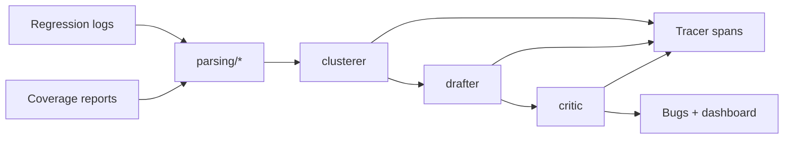
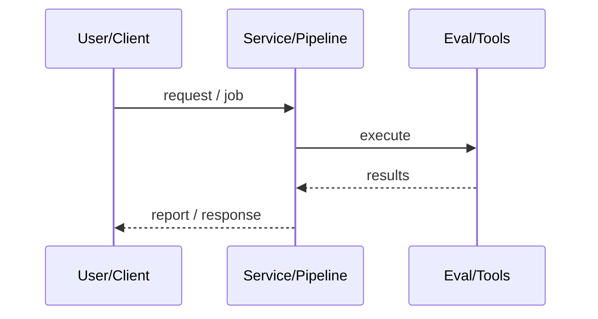
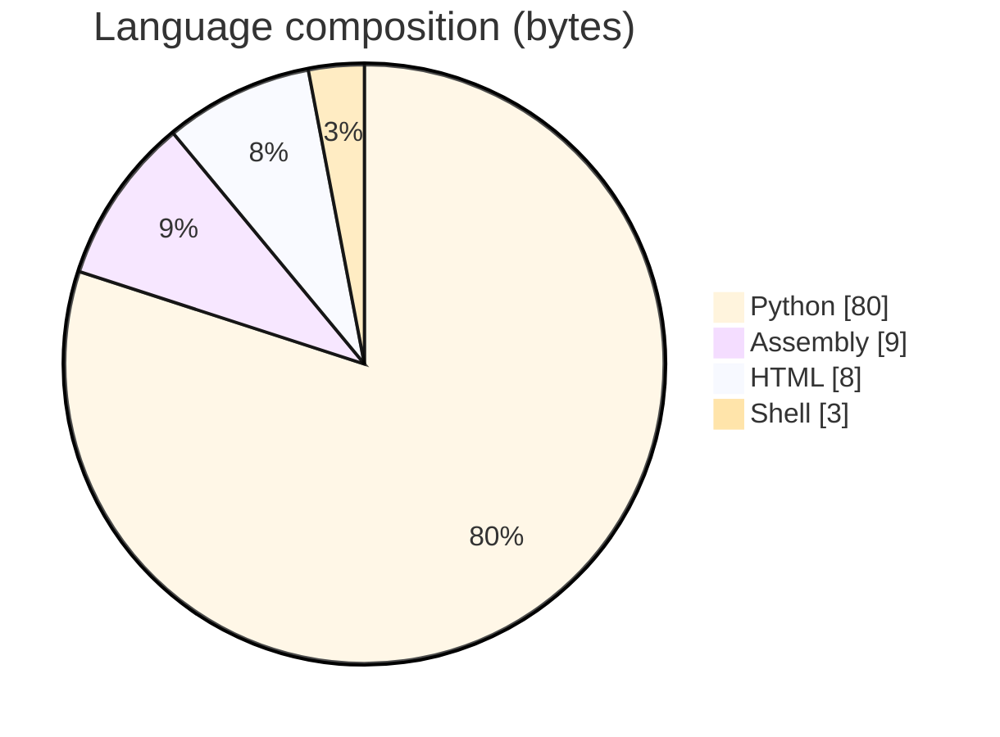

# Agentic Verification Triage System

### Multi-agent UVM/SystemVerilog coverage and regression triage with Clusterer, Drafter, Critic, and OTel-shaped tracing.

[](https://github.com/ArchanaChetan07/Agentic-Verification-Triage-System)
[](https://github.com/ArchanaChetan07/Agentic-Verification-Triage-System)
[](https://github.com/ArchanaChetan07/Agentic-Verification-Triage-System)
[](https://github.com/ArchanaChetan07/Agentic-Verification-Triage-System/actions)

---

## Overview

Chip verification regressions produce high-volume failure logs and coverage holes that do not scale with manual triage headcount.

Parse regression/coverage artifacts into signatures; cluster failures; draft prioritized bugs; run a critic for false positives; AgentMesh Tracer spans every decision.

Pipeline, agents, parsers, and dashboard implemented with 57 counted pytest functions; MIT Alpha package verification-triage 0.1.0.

This repository is maintained as **production-minded portfolio work**: clear architecture, automated checks where present, and metrics that are **traceable to committed artifacts** (never invented).

---

## Architecture

Regression/coverage inputs to parsers to Clusterer to Drafter to Critic to traced outputs and dashboard; vendored AgentMesh Tracer wraps decisions.





---

## Results & repository facts

> Only values found in code, configs, tests, or generated reports are listed. Absence of a clinical/ML accuracy number means it was **not** published in-repo.

| Metric | Value | Source |
|---|---|---|
| pytest test functions (counted in tests/) | **57** | `tests/test_*.py` |
| Package version | **0.1.0 Alpha** | `pyproject.toml` |
| Tracked files | **55** | `git tree` |
| Python modules | **25** | `git tree` |
| Test-related paths | **20** | `git tree` |
| CI workflows | **Yes** | `.github/workflows` |
| Docker present | **No** | `repo root` |



---

## Key features

- Coverage and regression parsers for verification artifacts
- Log-signature clustering of likely shared root causes
- Drafter agent producing prioritized bug candidates
- Critic agent flagging weak evidence / false positives
- End-to-end pipeline with OTel-shaped decision spans
- HTML dashboard generator for triage review

---

## Tech stack

| Layer | Technology |
|---|---|
| Language | Python |
| Framework | pytest |
| Framework | AgentMesh Tracer |
| Tool | ruff |
| Tool | GitHub Actions |

---

## Skills demonstrated

Python · pytest · AgentMesh (vendored) · OpenTelemetry-shaped Tracer · CI/CD · testing · automation

Keyword surface: **Python · Python · machine-learning · CI/CD · testing · API · Docker · automation · data-science · software-engineering · system-design · observability · LLM · cloud**

---

## Project structure

```text
Agentic-Verification-Triage-System/
├── triage/
│   ├── agents/ parsing/ pipeline.py dashboard.py models.py
├── scripts/ tests/ vendor/agentmesh/
├── Agentic_Verification_Triage_System_Proposal.md
└── pyproject.toml LICENSE
```

---

## Installation & usage

```bash
git clone https://github.com/ArchanaChetan07/Agentic-Verification-Triage-System.git
cd Agentic-Verification-Triage-System
pip install -e ".[dev]"
pytest -q
python scripts/run_real_data_pipeline.py
```

---

## How it works

Parsers normalize coverage and regression outputs into signatures. The Clusterer groups failures; the Drafter emits prioritized bug drafts from evidence templates; the Critic challenges weak drafts. triage/pipeline.py wraps assignments and verdicts in AgentMesh Tracer spans without yet routing LLM traffic through AdaptiveRouter.

Root README is template spam; the proposal and triage/ sources describe the real design.

---

## Future improvements

- Wire LLMDraftGenerator through AgentMesh Mesh/AdaptiveRouter
- Finish remaining proposal phases with measured triage-quality metrics
- Replace template README using proposal + test evidence

---

## License

MIT.

---

<p align="center">
  <b>Agentic Verification Triage System</b><br/>
  <a href="https://github.com/ArchanaChetan07/Agentic-Verification-Triage-System">github.com/ArchanaChetan07/Agentic-Verification-Triage-System</a>
</p>
